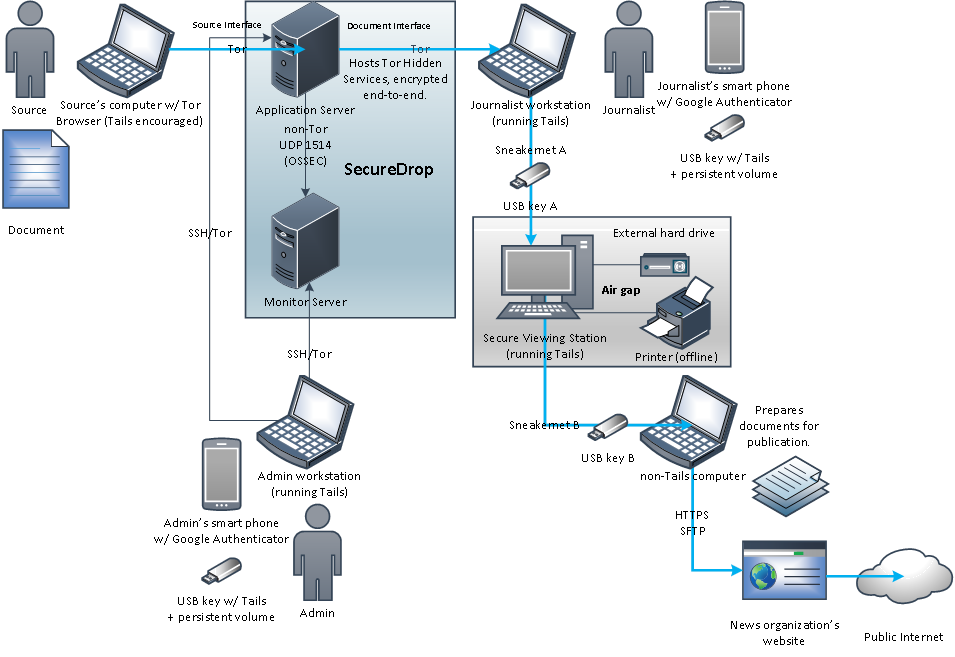

SecureDrop Overview
===================

SecureDrop is an open-source whistleblower submission system that media organizations can use to securely accept documents from and communicate with anonymous sources. It was originally created by the late Aaron Swartz and is currently managed by [Freedom of the Press Foundation][FPF].

Infrastructure
--------------

There are four main components of SecureDrop: the servers, the administrators, the sources, and the journalists.

### Servers

At SecureDrop's heart is a pair of severs: the *Application (“App”) Server* which runs the core SecureDrop software, and the *Monitor (“Mon”) Server* which keeps track of the *Application Server* and sends out alerts if there's a problem. These two servers run on dedicated hardware connected to a dedicated firewall appliance. They are typically located physically inside the newsroom.

### Systems Administrator

The SecureDrop servers are managed by a systems administrator; for larger newooms, there may be a team of systems administrators. The administrator uses a dedicated *Admin Workstation* running [Tails]() and connects to the App and Mon servers over authenticated [Tor Hidden Services]() and manages them using [Ansible]().

### Source

A source submits documents and messages by using [Tor Browser]() (or Tails) to access the *Source Interface*: a public Tor Hidden Service. Submissions are encrypted in place on the App server as they are uploaded.

### Journalists

Journalists working in the newsroom use two machines to interact with SecureDrop. First, they use a *Journalist Workstation* running Tails to connect to the *Document Interface*, an authenticated Tor Hidden Service. Journalists download [GPG]()-encrypted submissions and copy them to a *Transfer Device* (a thumb drive or DVD). Those submissions are then connected to the airgapped *Secure Viewing Station* (SVS) which holds the key to decrypt them. Journalists can then use the SVS to read, print, and otherwise prepare documents for publication. Apart from those deliberately published, decrypted document are never accessed on an Internet-connected computer.

* * * * *

The terms in italics are terms of art specific to SecureDrop. The [Terminology Guide](./terminology.md) provides more-precise definitions of these and other terms. SecureDrop is designed against a comprehensive [threat model](./thread-model.md), and has a specific notion of the [roles](./roles.md) that are involved in its operation.

Operation
---------

### Planning & Preparation

Setting up SecureDrop is a multi-step process. Before getting started, you should make sure that you're prepared to operate and maintain it. You'll need a systems administrator who's familiar with Linux, the GNU utilities, and the Bash shell. You'll need the [hardware](./hardware.md) on which SecureDrop runs — this will normally cost $2000-$3000 dollars. The journalists in your organization will need to be trained in the operation of SecureDrop, and you'll need to publish and promote your new SecureDrop instance afterwards — using your existing websites, mailing lists, and social media.

It is recommended that you have all of this planned out before you get started. If you need help, contact the [Freedom of the Press Foundation](https://securedrop.org/help) who will be glad to help walk you through the process and make sure that you're ready to proceeed.

### Technical Setup

Once you are familiar with the architecture and have all the hardware, [setting up SecureDrop](./install.md) will take at least a day's work for your admin. We recommend that you set aside at least a week to [complete and test](deployment_practices.md) your setup.

### Provisioning & Training

Once SecureDrop is installed, journalists will need to be provided with accounts, two-factor tokens, workstations, and so on — and then [trained](./training_schedule.md) to use these tools safely and reliably. You will probably also need to train additional backup administrators so that you can be sure that your SecureDrop setup keeps running even when your main administrator is on holiday.

Introducing staff to SecureDrop takes half a day. Training a group to use SecureDrop proficiently takes at least a day — and a single trainer can only work with so many people at once. You will probably need to run several training sessions to instruct an entire newsroom. Depending on staff availability, training and provisioning may take a week or more. If you have multiple offices, training will need to happen at each location. Again, the [Freedom of the Press Foundation](https://securedrop.org/help) are happy to help you plan and train your team.

### Going Public

Once you have a SecureDrop instance and your team knows how to use it, you should test is thoroughly and then tell the world. The [Freedom of the Press Foundation](https://securedrop.org/help) are happy to help you check that your SecureDrop setup is up-to-code and properly grounded. After that, you'll need to use your existing tools to announce and promote your SecureDrop. There are some [best practices](deployment_practices.md) for ways to show off and communicate your SecureDrop address, but more is better. Create a promotion/advocacy plan and go wild.

[FPF]: https://freedom.press
[Tails]: https://tails.boum.org
[Tor Hidden Services]: https://www.torproject.org/docs/hidden-services.html
[Ansible]: http://www.ansible.com/
[Tor Browser]: https://www.torproject.org/projects/torbrowser.html
[GPG]: https://www.gnupg.org/

