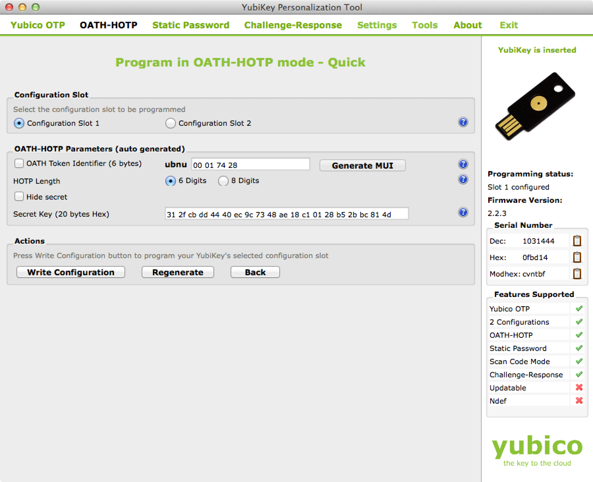

# Using YubiKey with the Document Interface

This is a quick and dirty guide to using YubiKey for two-factor authentication on the Document Interface.

## Download the YubiKey personalization tool

YubiKeys are modifiable using the YubiKey personalization tool, which is available for Windows/Mac/Linux and can be downloaded here: http://www.yubico.com/products/services-software/personalization-tools/use/. If you wish to use Tails, install the YubiKey personalization tool on the command line with `apt-get install yubikey-personalization-gui`.

Once you have downloaded and installed the personalization program, insert your YubiKey and launch the program. If you are running Tails, you need to launch the program as the root user.

## Set up OATH-HOTP

When you first launch the program, you will see the heading "Personalize your YubiKey in:" following by a list of configuration options. The SecureDrop admin interface uses "OATH-HOTP mode", so click that entry in the list.

The next window will have the heading "Program in OATH-HOTP mode" and will offer you a choice between "Quick" or "Advanced" configuration. Choose "Quick".

First choose the configuration slot for this token. Unless you already use the YubiKey for something else, you should choose Configuration Slot 1. If you already using the first slot, choose Configuration Slot 2. Note that you will have to press and hold for several seconds to use the token from Slot 2 instead of the one in Slot 1. See the [YubiKey manual](http://www.yubico.com/wp-content/uploads/2013/07/YubiKey-Manual-v3_1.pdf) for more information.

In the section title "OATH-HOTP parameters", you will need to change the default settings. First, *uncheck* the checkbox for "OATH Token Identifier (6 bytes)". Also uncheck the box for "Hide secret". This will display the data in the "Secret Key (20 bytes hex)" field. This data cannot be copied unless the "Hide secret" box is unchecked.

Now that you have chosen the correct configuration options for use with SecureDrop, click the "Write Configuration" button. Click through the warning about overwriting Configuration Slot 1 and choose a location to save the log file.

When the configuration has been successfully written, you should see green text saying "YubiKey successfully configured" at the top of the window.

## Set up a user with the OATH-HOTP secret key

Now you will have to set up a new user for the Document Interface with the secret key from the "Secret Key (20 bytes hex)" field.

### manage.py

If you have just installed SecureDrop, you will need to add the first admin user to the Document Interface with `manage.py`. `cd` to the `SECUREDROP_ROOT`, which is `/vagrant/securedrop` in development and `/var/www/securedrop` in production. Run `./manage.py add_admin`. Fill in the username and password prompts. When it asks "Is this admin using a YubiKey [HOTP]? (y/N)", type "y", then enter. At the "Please configure your YubiKey and enter the secret:" prompt, enter the Secret Key value and hit enter. Note that the spaces are optional. When you are done, you should see a message saying "Admin '(your username)' successfully added".

### Admin Interface

If you already have an admin user configured, use the "Add user" page in the admin interface to add new users. If they want to use YubiKey for two-factor, just check the "I'm using a YubiKey [HOTP]" checkbox and enter the Secret Key in the "HOTP secret" field.

